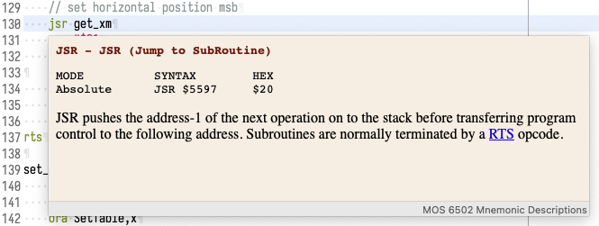

# Commodore Commander

A set of plugins to the Eclipse IDE that adds support for building Commodore 64 applications using the Kick Assembler for the MOS 6510 processor. It currently have the following features:

* Editor based on the 6502 TextMate grammar
* As with most Eclipse based editors:
  * "Quick diff" and revision information in the gutter (must be enabled)
  * Task and bookmarks
  * Search and navigation etc.
* Tooltips for 6510 mnemonics
* Tooltips for the Commodore 64 memory map
* Built in Kick Assembler compiler
* Automatic compilation when a file has changed
* Problem markers when a compilation produces errors
* Compilation output to the Commodore Commander console
* Launch the Vice emulator when double clicking a *.prg file

This comes with world class Git-support from the Eclipse Platform, along with all other feature Eclipse offers.

PS: If you like a different theme, right click in the gutter and select **Switch to Theme**.

--
This set of plugins is currently not usable in standalone form. You are better off starting it in debug mode from the Eclipse instance used to build it.
