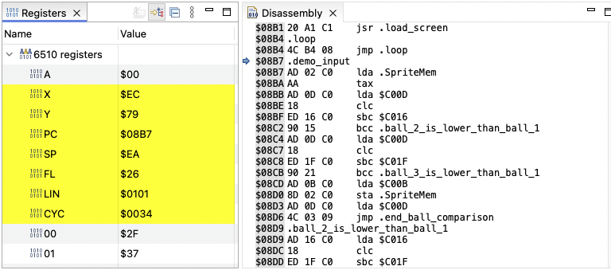

# Commodore Commander

This project comprises of a set of plugins to the Eclipse IDE that adds support for building Commodore 64 applications using the [Kick Assembler](http://theweb.dk/KickAssembler/Main.html#frontpage) for the MOS 6510 processor and the [VICE emulator](https://vice-emu.sourceforge.io) for running and debugging. This project's focus will be on editing and debugging – not resource management, of which there are many other excellent tools.

It is still in a very early stage, but it is usable and currently have the following features:

## Editing

* Editor based on the 6502 TextMate grammar
* As with most Eclipse based editors:
  * "Quick diff" and revision information
  * Task and bookmarks
  * Search and navigation
  * Block selection
  * `TODO` and `FIXME` markers
* Tooltips for 6510 mnemonics
* Tooltips for the Commodore 64 memory map

> [!NOTE]
> The editor is being rewritten in order to ease reuse and provide better than basic editing features and tooltips.

## Compiling

* Built in [Kick Assembler](http://theweb.dk/KickAssembler/Main.html#frontpage) compiler
* Built in [VICE](https://vice-emu.sourceforge.io) emulator
  * Currently only macOS on ARM
  * 64bit Windows GTK version (planned)
  * 64bit macoS Intel GTK version (planned)
* Automatic compilation when a file has changed
  * The source hierarchy is automatically calculated, so no need to specify main files.
* Problem markers when a compilation produces errors
* Compilation output to the Commodore Commander console
* Launch the VICE emulator when double clicking a `*.prg` file
* Launches will automatically pick up VICE configuration files found either in the same folder as the program, or in any of it's parent folders.

## Debugging

The debugger implements a [VICE Binary Monitor](https://vice-emu.sourceforge.io/vice_12.html) interface and is currently fairly basic. The plan is to implement a **fully featured** debugger.

* Support for Eclipse run and debug launch shortcuts.
* Debug launches will in addition automatically pick up `*.vs` files created by Kick Assembler passes these to VICE.
  * Symbol declarations
  * `.break` and `.trace`
* Support for _suspend_, _resume_ and _terminate_

* _Registers_ view show changed values since last break in yellow
* _Disassembly_ view show the current disassambly along with the PC

