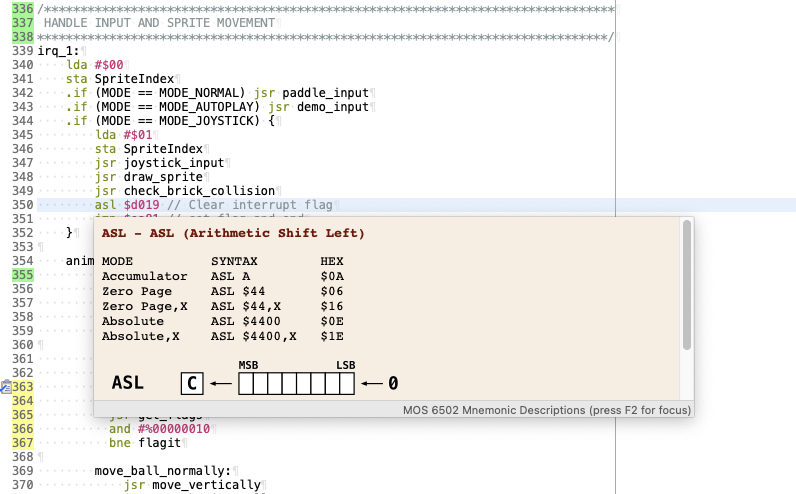
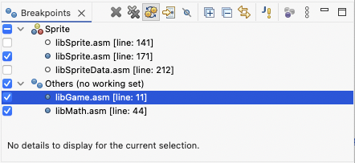
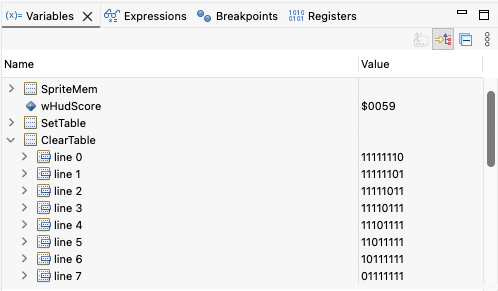
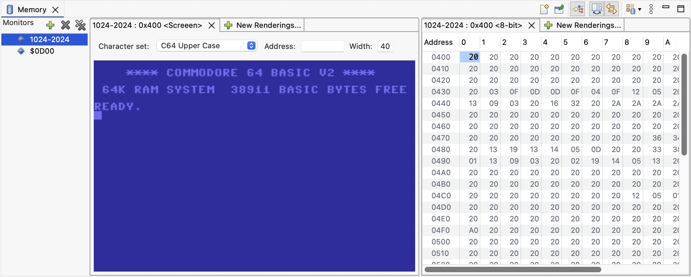
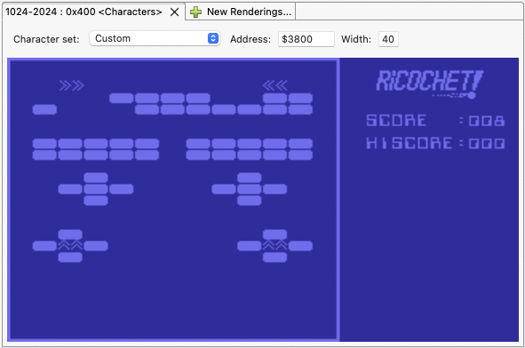

The Commodore 64, an iconic 8-bit home computer from the 1980s, has experienced a vibrant renaissance in the retro computing world. Renowned for its affordability, robust hardware, and expansive software library, the C64 continues to captivate enthusiasts worldwide. Modern resources such as FPGA-based replicas, enhanced peripherals, and thriving online communities have made it easier than ever to explore and develop for this classic machine. Essential tools like cross-assemblers, emulators like VICE, and comprehensive documentation for its 6502 architecture have become indispensable for both newcomers and seasoned developers.

Programming for the Commodore 64 is an enjoyable experience, thanks to its simplicity, constraints, and direct interaction with hardware. The 6502 assembly language offers a rewarding challenge that inspires creativity, while the well-documented architecture and active retro community make problem-solving an engaging process. Whether pushing graphical limits, composing SID chip music, or crafting efficient code within tight memory constraints, developing for the C64 is a nostalgic journey that combines technical mastery with pure joy.

The _Commodore Commander_ aims to be a valuable addition to this ecosystem of tools.

This project provides a set of plugins for the Eclipse IDE, and targets streamlined development for the Commodore 64. It supports building applications using [Kick Assembler](http://theweb.dk/KickAssembler/Main.html#frontpage) and integrates with the [VICE emulator](https://vice-emu.sourceforge.io) for running and debugging code. While the focus of Commodore Commander is on editing and debugging, it complements existing resource management tools, offering developers a cohesive and modernized workflow for creating on this beloved platform.

# Editing



* Editor with 6502 opcode syntax coloring
* As with most Eclipse based editors:
  * "Quick diff" and revision information
  * Task and bookmarks
  * Search and navigation
  * Block selection
  * `TODO` and `FIXME` markers
  * Bookmarks, and much more
* Tooltips for 6510 mnemonics
* Tooltips for the Commodore 64 memory map

# Compiling

Compilation is done automatically with the built-in [Kick Assembler](http://theweb.dk/KickAssembler/Main.html#frontpage) compiler whenever a source file has been changed.

* Problem markers when a compilation produces errors.
* Compilation output to the _Commodore Commander_ console view.

# Running

* Launches the VICE emulator when double clicking a `*.prg` file.
* Launches will automatically pick up VICE configuration files found either in the same folder as the program, or in any of it's parent folders.

# Debugging

The debugger implements a [VICE Binary Monitor](https://vice-emu.sourceforge.io/vice_12.html) interface and is currently fairly basic. It currently supports the following features:

* Built in [VICE](https://vice-emu.sourceforge.io) emulator
  * macOS GTK version on aarch64 and x86
  * Windows GTK x86 version (planned)
  * Linux GTK x86 version (planned)
* Support for Eclipse run and debug launch shortcuts.
* Debug launches pick up `*.vs` files created by Kick Assembler and passes these to VICE.
* Support for _step over_, _step into_, _step return_, _suspend_, _resume_ and _terminate_

## Breakpoints



The only type of _checkpoints_ currently supported are _breakpoints_. These are triggered whenever the _program counter_ enteres an address where a breakpoint has been added and will halt the emulator. Breakpoints can be individually disabled and enabled, and as usual be grouped, placed in working sets etc.

## Variables

When building your application, the IDE will automatically detect sections of code that are labelled and that contains data. For example:

```asy
ClearTable:
    .byte %11111110
    .byte %11111101
    .byte %11111011
```

The parser will also determine which format was used to declare the values and this information is used when presenting the value in the IDE.



Values that are shown using the diamond icon are editable. Simply click on the value cell and specify a new value.

## Memory monitor

The memory monitor is used to observe and edit the main computer memory.

Using the **New Memory View**  command you can create a view that is able to display one single area of memory at the time (**Add Memory Monitor** ). This will bring up a prompt where you can specify the from and optionally to-address in either hexadecimal (prefix with `0x` or `$`). Use `-` to specify a range, and `,` to create multiple monitors.

Each monitor can be presented using different _renderings_. Each rendering is a visualization of the memory area and may or may not be editable. The table renderings are typically editable, while the screen rendering shown below is not.



Note that monitors are only updated when the CPU has stopped because of i.e. a breakpoint and any changes to the memory will only take effect when the CPU has resumed operation.

By selecting _Custom_ **Character set** and specifying it's location one can see the memory monitor rendered using this character set.




# Related resources

These resources are only some of those consulted when building this IDE. You may find them useful:

- [The Kick Assembler](http://theweb.dk/KickAssembler)
- [VICE, the Versatile Commodore Emulator](http://vice-emu.sourceforge.net)
- [Cycle-accurate 6502 emulator in Javascript](https://github.com/Torlus/6502.js)
- [Tuned Simon's BASIC](https://github.com/godot64/TSB)
- [SpritePad C64 Pro](https://subchristsoftware.itch.io/spritepad-c64-pro)
- [CharPad C64 Pro](https://subchristsoftware.itch.io/charpad-c64-pro)
- [SpriteMate](https://www.spritemate.com)
- [GoatTracker2](https://sourceforge.net/projects/goattracker2)
- [Colordore](https://www.pepto.de/projects/colorvic/)
- [PETSCII, A nice web-based editor for sprites, character maps and screens](http://petscii.krissz.hu)
- [JustJ, a Java Runtime for Eclipse](https://eclipse.dev/justj/?page=documentation)
- [Inside the Memory View: A Guide for Debug Providers](https://www.eclipse.org/articles/Article-MemoryView)
- The 1965-1984 [Commodore logo](https://en.wikipedia.org/wiki/Commodore_International#/media/File:Commodore196x.svg) [font](https://www.myfonts.com/products/d-bold-extended-microgramma-330289) (Microgramma D)
- https://www.eclipse.org/articles/Article-Debugger/how-to.html
- [64Tass](https://sourceforge.net/projects/tass64/)
- [65xx Debugger](https://marketplace.visualstudio.com/items?itemName=TRobertson.db65xx)