The Commodore 64, an iconic 8-bit home computer from the 1980s, has experienced a vibrant renaissance in the retro computing world. Renowned for its affordability, robust hardware, and expansive software library, the C64 continues to captivate enthusiasts worldwide. Modern resources such as FPGA-based replicas, enhanced peripherals, and thriving online communities have made it easier than ever to explore and develop for this classic machine. Essential tools like cross-assemblers, emulators like VICE, and comprehensive documentation for its 6502 architecture have become indispensable for both newcomers and seasoned developers.

Programming for the Commodore 64 is an enjoyable experience, thanks to its simplicity, constraints, and direct interaction with hardware. The 6502 assembly language offers a rewarding challenge that inspires creativity, while the well-documented architecture and active retro community make problem-solving an engaging process. Whether pushing graphical limits, composing SID chip music, or crafting efficient code within tight memory constraints, developing for the C64 is a nostalgic journey that combines technical mastery with pure joy.

The _Commodore Commander_ aims to be a useful addition to this ecosystem of tools.

## Editor support

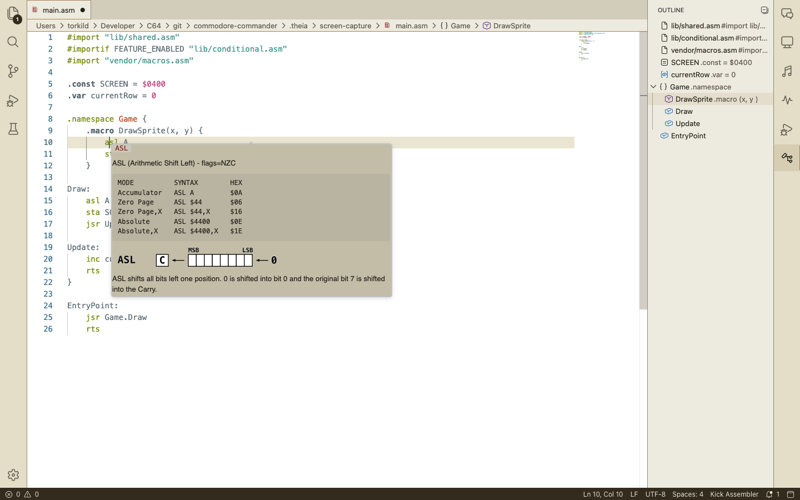

Commodore Commander adds Kick Assembler language support to Theia, including
syntax highlighting, symbol/directive/include completion, 6502 mnemonic help,
hover/reference navigation, rename, outline/workspace symbols, semantic
highlighting, folding, formatting, and quick fixes. The Active Machine selector
filters machine-specific reference symbols and feeds the emulator-oriented
workflow used by builds and debugging.

For day-to-day source editing workflows, see
[Editing User Guide](bundled-docs/editing-user-guide.md). Build profiles,
program discovery, generated launch entries, and headless use are covered in
[Build Configuration](bundled-docs/build-configuration.md).

## Character set editor

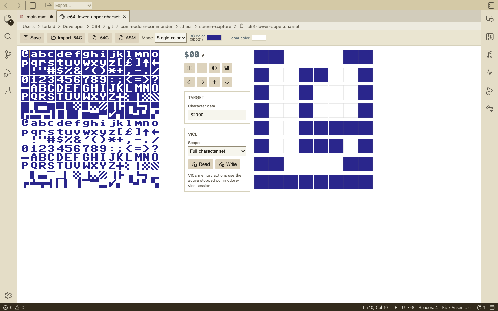

Commodore Commander includes a character set editor for C64-style 8x8
character data. Character sets are saved as `.charset` JSON files with the
display name derived from the filename, while raw imports and exports use the
2048-byte C64 character data layout.

The editor provides:

- a 256-character screen-code table with live previews
- an 8x8 pixel editor for the selected glyph
- single-color and multi-color rendering modes
- C64 palette controls for background, foreground, and multi-color registers
- import/export for `.64C`, `.bin`, and `.chr` character data
- KickAssembler `.asm` export for embedding character sets in source

Raw `.64C`, `.bin`, and `.chr` imports can include a two-byte C64 load address,
such as `$3800`; the importer skips that prefix so glyph row data stays aligned.

## Screen editor

Commodore Commander includes a PETSCII-style screen editor for C64 screen-code
artwork. Screens are saved as `.screen` JSON files containing the screen cells,
color RAM values, global VIC-II colors, and an embedded 256-character set.

The editor provides:

- a C64 screen canvas with border and background color rendering
- a 256-character screen-code table for choosing the active glyph
- an embedded bitmap editor for changing the selected character glyph
- per-cell character and color painting
- keyboard entry for common printable screen codes
- single-color and multi-color character rendering modes
- `.charset` import for replacing the embedded character set
- `.seq` import for PETSCII control streams with color, reverse, and charset codes
- `.seq`, `.scr`, `.col`, and KickAssembler `.asm` export

## Music and sound effects

Commodore Commander supports [SIDScore](https://github.com/turesheim/SIDScore),
a DSL and toolchain for composing Commodore 64 SID music and sound effects. It
provides real-time auditioning, MIDI input, dedicated instrument controls, and
export to ASM, PRG, SID, and WAV. Playback fidelity is improved by aligning the
built-in `sidscore` driver with the timing of the real-time player while keeping
the exported result compatible with PSID players such as VICE and VSID.

### SIDScore voice visualiser

The voice visualiser receives ordered audio samples from the SIDScore real-time
renderer and displays voices 1, 2, and 3 independently. The note, waveform, and
envelope level shown beside each plot describe the current voice state. Use the
**View** control to switch between the time-domain **Waveform** view and the
frequency-domain **Spectrogram** view while playback continues.

#### Waveform

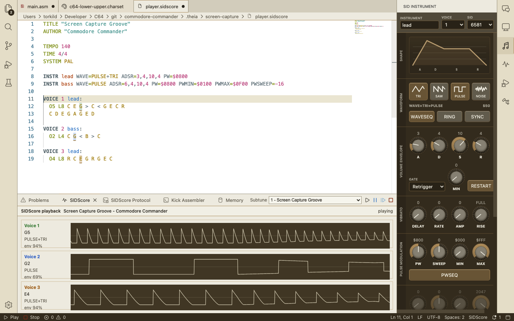

The waveform view plots sample amplitude against time for each voice. At the
usual 44.1 kHz sample rate, the 2,048 displayed samples cover approximately 46
milliseconds. Each trace is centred on zero and may be enlarged automatically,
up to three times, to make quieter waveforms legible. The vertical scale is
therefore useful for inspecting shape and timing, but it is not a fixed level
scale for comparing loudness between voices.

**Free** mode always shows the newest samples. This is useful for attacks,
releases, pulse-width sweeps, and other changing signals, but a periodic wave
will normally appear to move horizontally. **Triggered** mode finds the latest
rising midpoint crossing in the selected trigger voice and places it at the
dashed vertical line. The same time offset is applied to all three voices, so
their relative timing is preserved while periodic waveforms appear stationary.
The **V1**, **V2**, and **V3** controls select the common trigger source. If that
voice is silent or has too little signal range, the visualiser falls back to
the newest samples and omits the trigger line.

#### Spectrogram

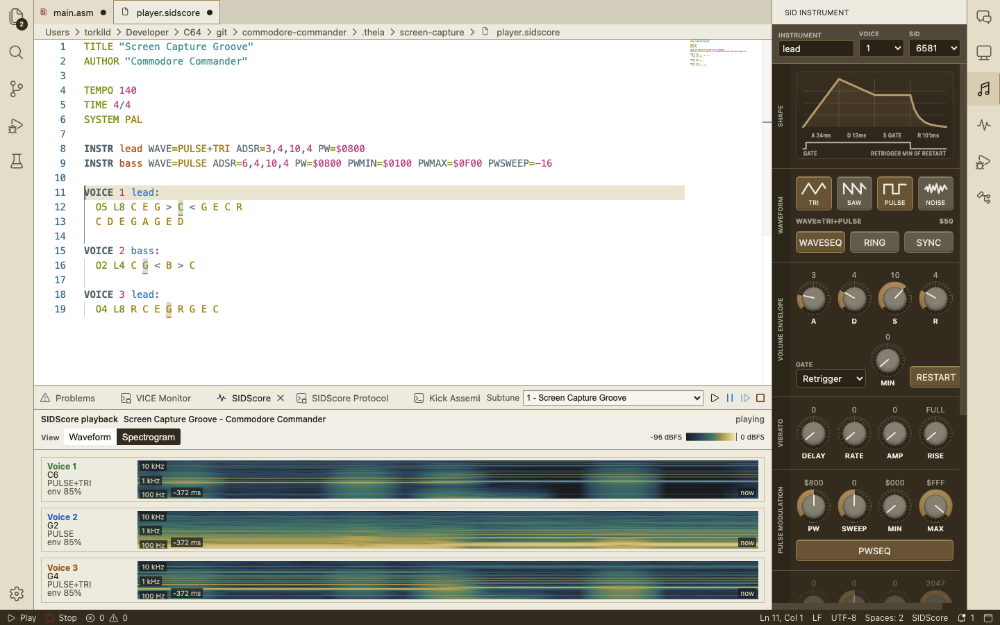

The spectrogram shows how the frequency content of each rendered voice changes
over time:

- **Horizontal position is time.** Older samples are on the left and the newest
  analysis window is on the right. The default history is 16,384 samples, or
  approximately 372 milliseconds at 44.1 kHz.
- **Vertical position is frequency on a logarithmic scale.** At 44.1 kHz the
  display covers 50 Hz to the 22.05 kHz Nyquist limit. The 100 Hz, 1 kHz, and
  10 kHz labels are reference lines, not the limits: content below 100 Hz and
  above 10 kHz is still included.
- **Colour is level in dBFS.** The fixed legend runs from -96 dBFS (dark) to
  0 dBFS (light). dBFS is relative to digital full scale, not acoustic sound
  pressure. Because the scale is fixed rather than normalised per frame, colour
  can be compared over time and between the three voices.

Each column is calculated from a 2,048-sample Hann-windowed FFT, with a
256-sample hop between columns. At 44.1 kHz this gives an analysis window of
approximately 46 milliseconds and a new column every 5.8 milliseconds. The
Hann window reduces spectral leakage caused by cutting the signal into short
frames. The window also spreads an abrupt change across a short interval; the
view is therefore a time-frequency analysis rather than an instantaneous list
of oscillator frequencies.

A pitched waveform normally appears as a fundamental band with harmonic bands
above it. Saw and pulse waves contain stronger high harmonics than a triangle
wave, while noise produces energy across a broad frequency range. Pulse-width
changes alter the harmonic pattern, and filter cutoff or resonance modulation
changes which bands remain strong over time. The display analyses the separate
voice samples produced by SIDScore's digital real-time renderer, including its
filter-routing contribution. It does not show only the SID frequency register,
and it is not a measurement of the analogue output of a physical 6581 or 8580.

The SID SFX editor provides a focused workspace for one-shot game sound
effects. It starts from a small preset catalogue and exposes SIDScore controls
for waveform, pitch sweep, ADSR envelope, pulse width, priority, voice
selection, and retrigger behaviour. The editor visualises the envelope, pitch
movement, and gate-off point while generating a SIDScore `EFFECT` block that
can be previewed, stopped, or copied into a project source file.

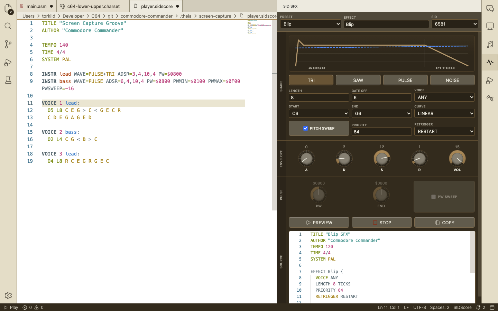

Note that export to SID/ASM is not a very efficient format. If you need to optimise for size, hand-coding the music and sound effects is a better option.

## Debugging

Commodore Commander contributes a Theia-native `commodore-vice` [Debug Adapter Protocol](https://microsoft.github.io/debug-adapter-protocol/) (DAP) adapter for launching PRG files in [VICE](https://vice-emu.sourceforge.io). Launch configurations can be provided in `.theia/launch.json`, generated from the active [Kick Assembler](https://theweb.dk/KickAssembler/Main.html#frontpage) file, or discovered from `commodore-commander.build.json`.

Press **F5** from a Kick Assembler source file to build the active program,
start a `commodore-vice` debug session, and attach Theia's debugger to VICE's
binary monitor. The embedded **Emulator** view is the live VICE display used by
the session, so keyboard input goes to the emulated machine when the canvas has
focus. Use **CAPTURE** to send keyboard input to the emulator and when a
program needs relative mouse or paddle input. Use **RESET** to reset the active
machine, **F12** to open the VICE menu, and **Esc** to release pointer lock.
**Ctrl+F5** starts the same PRG without the debugger; in that mode breakpoints,
stepping, watchpoints, and memory inspection are disabled.

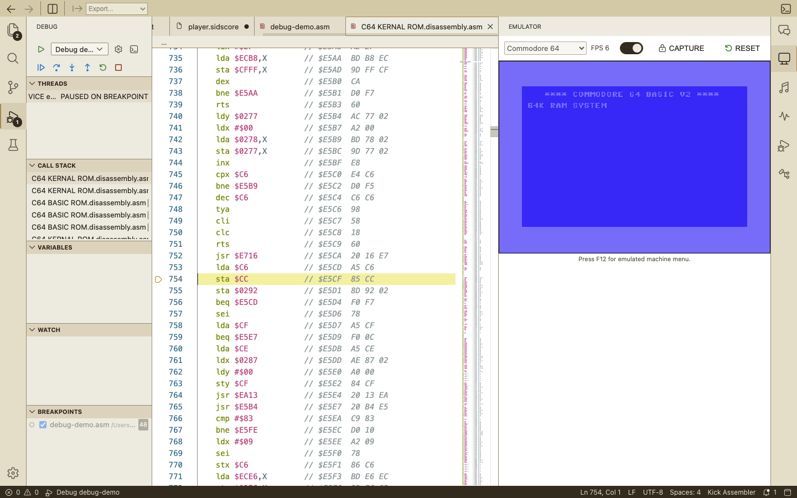

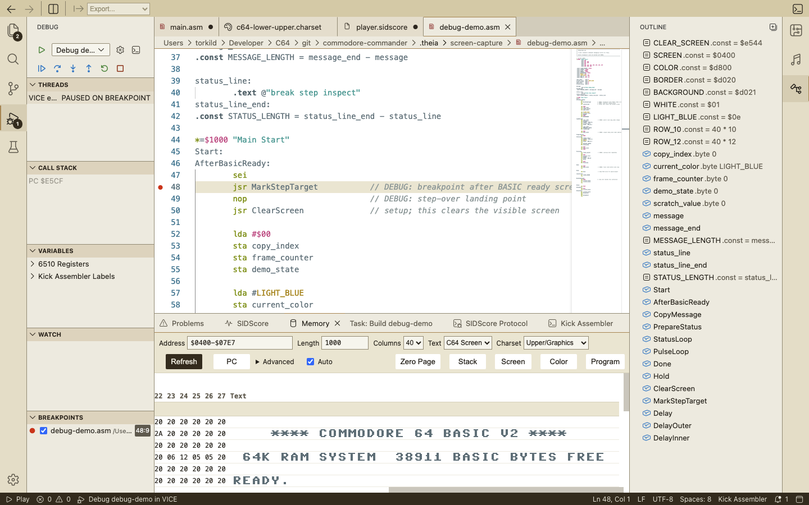

The debugger screenshot starts a named `.theia/launch.json` configuration,
waits for VICE to stop after the BASIC ready screen is painted, and shows C64
screen RAM rendered through the Memory view.

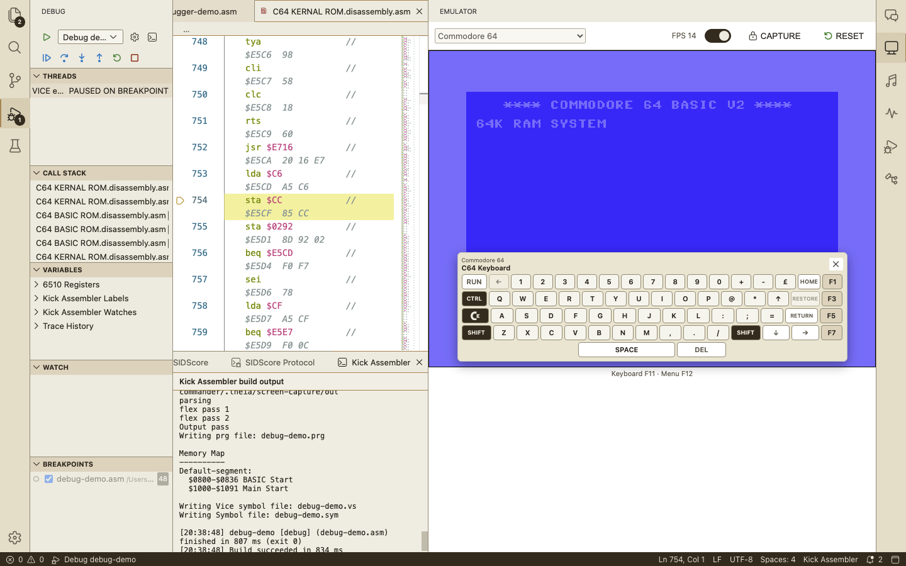

The Machine view includes a compact virtual keyboard overlay for the active
Commodore profile, shown here with a C64 session. The overlay follows the same
PETSCII-aware keyboard mapping as physical input and can be toggled with F11
while an embedded emulator is running.

### Implemented debugger features:

- launch and terminate VICE from Theia's built-in Run and Debug commands
- Start Without Debugging through DAP `noDebug`, which starts VICE without the binary monitor
- `commodoreCommander.VICE.launchMode` defaults to `patchedView`, the intended
  embedded VICE surface for patched runtimes with frame/input transport. The
  patched runtime is based on the VICE 3.10.0 release tag
  `tags/v3.10/vice`; `externalWindow` keeps stock VICE in its own window as a
  compatibility path
- the embedded VICE view contributes a Theia canvas and process bridge for the
  patched SDL runtime. The first native patch and protocol notes live under
  `tools/vice-embed/`; run `npm run vice:assets` to build and sync the patched
  VICE runtime before packaging
- preference-backed external tool paths for installed VICE and Java:
  `commodoreCommander.VICE.runtimePath` selects a VICE runtime or installation
  root, while `commodoreCommander.tools.javaRuntime` selects Java 21 or newer.
  SIDScore checks the selected Java runtime before startup and reports a clear
  error when the system Java is too old.
- Kick Assembler `.dbg` source mapping for source breakpoints, breakpoint locations, loaded sources, labels, and source-backed stack frame locations with nearest-line fallback and generated PRG-disassembly fallback
- source breakpoints and memory data breakpoints/watchpoints through VICE binary-monitor checkpoints, including VICE checkpoint conditions and DAP-style hit conditions
- logpoints/tracepoints for source lines, using non-stopping VICE checkpoints when the log message only needs static values and adapter-managed stop/log/resume when live register values are needed
- persistent memory watchpoint management from the Debug breakpoints menu, with add, enable/disable, edit, delete, clear, and reinstall actions
- watchpoint stop descriptions that include the configured range, actual read/write access type, current PC, and current watched byte values
- adapter-observed Trace History in the Variables view, with Debug Console commands for recent PC samples, last observed watched writes, and register changes
- Watch view evaluation for registers, labels, and address expressions such as `label+1`, plus Kick Assembler `.watch` entries exposed as live memory values in the Variables view
- continue, pause, step in, step over, and step out controls
- register and Kick Assembler label scopes in Theia's Variables view
- editing CPU registers through DAP `setVariable`
- Debug Console evaluation of registers, labels, numeric addresses, and memory references
- hardware-stack call trace reconstruction from validated 6502 `JSR` return addresses
- DAP `readMemory`, `writeMemory`, `source`, loaded-sources, and complete NMOS 6502 disassembly support, including undocumented opcodes
- generated C64 BASIC/KERNAL ROM disassembly sources using bundled VICE ROM images and labels parsed from VICE's `share/vice/C64/c64mem.sym`
- a Theia Memory view that reads and writes through the active stopped `commodore-vice` debug session, with address/range expressions, label resolution, C64 screen and color RAM presets, configurable row widths, memory space and bank controls, changed-byte highlighting, and ASCII/PETSCII/screen renderings

Stack reconstruction is based on the live page-$01 CPU stack and validates caller frames against matching `JSR` instructions in memory. When a stack address does not map to original source, the adapter indexes the launched PRG and exposes a generated disassembly source so the stack frame still has an address-accurate landing point. If the address is outside the launched PRG range, it falls back to a live VICE memory disassembly for that address. Branches such as `BNE` and plain `JMP` do not create call-stack frames because they do not push return addresses; the stack frame name includes the nearest containing label for that kind of loop context.

ROM stack frames are generated from the VICE C64 ROM assets bundled with the application. `c64mem.sym` is VICE monitor symbol metadata, copied from `share/vice/C64/c64mem.sym` into the packaged runtime; it provides labels such as `bGONE`, `kCHROUT`, and I/O aliases. These generated ROM sources are address-accurate disassembly with VICE labels, not original Commodore source.

### C64 visual debugger

The C64 Visual Debugger complements the DAP views with machine-specific state from a stopped VICE session. It decodes VIC-II registers, shows raster position and VIC bank selection, renders sprite patterns and sprite flags, and visualizes screen RAM, character memory, color RAM, CIA timers, IRQ sources, and keyboard matrix registers.

| VIC-II state | Sprites |
| --- | --- |
| 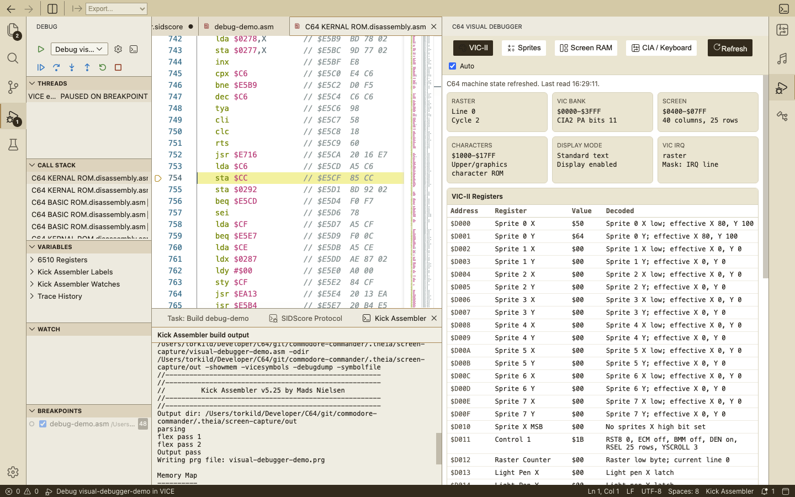 | 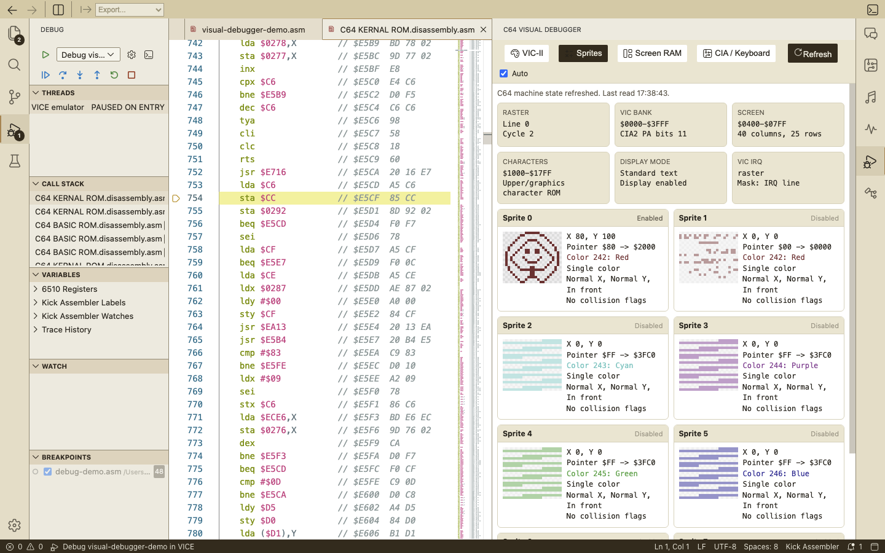 |

| Screen, character, and color RAM | CIA and keyboard state |
| --- | --- |
| 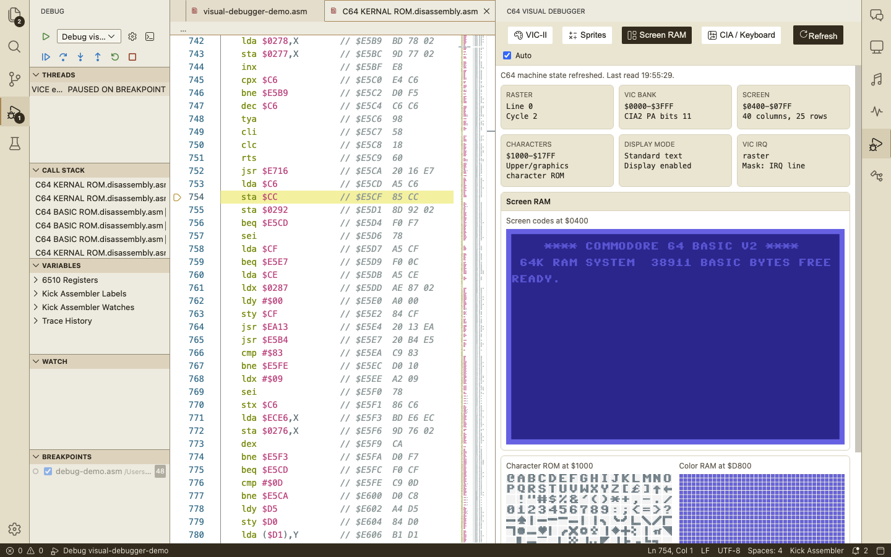 | 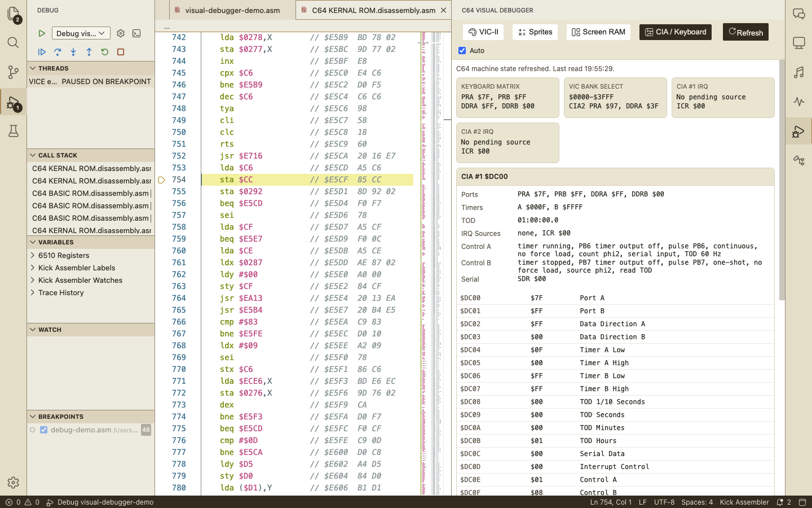 |


# Developer resources

## Product packages

Build a distributable macOS app bundle with:

```sh
npm run package:mac
```

The command builds the Theia Electron application and writes a single app bundle to `dist/mac/Commodore Commander.app`. The bundle includes the Theia frontend and backend, downloaded local plugins, bundled docs, Kick Assembler, SIDScore, and the embedded Apple Silicon VICE payload.

By default the bundle is ad-hoc signed. Set `CC_CODESIGN_IDENTITY` to use a Developer ID identity and `CC_BUNDLE_ID` to override the bundle identifier. Notarization and a DMG/zip installer are still manual release steps.

To build the current runner platform without the macOS-only bundle assumptions,
run:

```sh
npm run package:current
```

Nightly product packages are built by GitHub Actions for macOS, Windows, and
Linux. The scheduled workflow uploads run artifacts and refreshes the mutable
`nightly` prerelease after all three platform packages build successfully.
Each product package is smoke-tested before upload by starting the bundled
SIDScore player server from the packaged Kick Assembler and SIDScore assets and
running a MIDI-device scan through the SRAP protocol. The smoke test also
checks that the selected Java runtime supports the bundled SIDScore CLI.
The macOS nightly package is ad-hoc signed unless these repository secrets are
configured:

- `MACOS_CODESIGN_CERTIFICATE_BASE64`: base64-encoded Developer ID Application
  `.p12` certificate.
- `MACOS_CODESIGN_CERTIFICATE_PASSWORD`: password for the `.p12` certificate.
- `MACOS_CODESIGN_IDENTITY`: optional explicit identity name, such as
  `Developer ID Application: Example, Inc. (TEAMID)`.
- `MACOS_CODESIGN_KEYCHAIN_PASSWORD`: optional temporary keychain password.

## Screenshots

Regenerate these Theia screenshots with:

```sh
npm run theia:build
npm run screenshots:theia
```

The capture script launches the Electron app with a temporary screen-capture configuration and writes the screenshots under `docs/`. The generated screen-capture workspace lives under `.theia/screen-capture` so the capture pass does not edit the checked-in test fixtures or trigger the Kick Assembler build watcher.
The debugger capture builds and launches the `debug-demo` fixture, waits until
BASIC has painted the ready screen, and captures both the embedded Emulator
view and the Memory view for the README.

The visual-debugger capture builds and launches the `visual-debugger-demo`
fixture, waits until BASIC has painted the ready screen, prepares sprite state
through DAP memory writes without clearing screen RAM, and switches through the
VIC-II, Sprites, Screen RAM, and CIA tabs so the README images can be refreshed
after UI changes.

## Theia UI E2E

Run focused debugger UI automation with:

```sh
npm run theia:build
npm run test:e2e:theia:ui
```

The UI e2e runner launches the built Electron app against a temporary workspace,
starts real debug sessions, checks the Debug and Memory views, edits a
memory byte through the Memory view, and switches through the C64 Visual
Debugger views. The VICE GitHub Actions workflow runs the same lane on Linux
under Xvfb. Use `--vice-executable`, `--vice-resources`, and `--vice-args` to
test against an external VICE runtime.


These resources are only some of those consulted when building this IDE. You may find them useful:

- [The Kick Assembler](http://theweb.dk/KickAssembler)
	- [Kick Assembler announcement](https://csdb.dk/forums/?roomid=11&topicid=26156&showallposts=1)
- [Tuned Simon's BASIC](https://github.com/godot64/TSB)
- [SpritePad C64 Pro](https://subchristsoftware.itch.io/spritepad-c64-pro)
- [CharPad C64 Pro](https://subchristsoftware.itch.io/charpad-c64-pro)
- [SpriteMate](https://www.spritemate.com)
- [GoatTracker2](https://sourceforge.net/projects/goattracker2)
- [Colordore](https://www.pepto.de/projects/colorvic/)
- [PETSCII, A nice web-based editor for sprites, character maps and screens](http://petscii.krissz.hu)
- The 1965-1984 [Commodore logo](https://en.wikipedia.org/wiki/Commodore_International#/media/File:Commodore196x.svg) [font](https://www.myfonts.com/products/d-bold-extended-microgramma-330289) (Microgramma D)
- [64Tass](https://sourceforge.net/projects/tass64/)
- [65xx Debugger](https://marketplace.visualstudio.com/items?itemName=TRobertson.db65xx)

## Emulators

* [VICE, the Versatile Commodore Emulator](http://vice-emu.sourceforge.net)
* [Cycle-accurate 6502 emulator in Javascript](https://github.com/Torlus/6502.js)

## Other Commodore IDEs

* [Retro C64](https://retroc64.github.io) – RetroC64 is a modern Commodore 64 development environment built around C# and .NET, using VS Code and the VICE emulator as its front end. Instead of writing raw assembly, you generate 6502 code programmatically via a C# DSL, with full build, run, and debug integration. It provides a tight “live coding” loop and advanced debugging (CPU, memory, VIC-II, SID), effectively acting as a high-level toolchain for low-level C64 development.
* [C64 IDE for macOS](https://gopherbrokesoftware.com) – is a free, macOS-based development environment for the Commodore 64 that combines modern IDE features with authentic retro programming workflows. The C64 IDE provides syntax-aware editing for BASIC and 6502 assembly, integrated build and debug tooling via the VICE emulator, and conveniences like one-click build/run, inline documentation, and direct deployment to real hardware. The overall approach is to modernize C64 development—bringing features like source-level debugging, Git integration, and multi-file projects—while preserving low-level control and fidelity to the original platform.
* [VS64](https://marketplace.visualstudio.com/items?itemName=rosc.vs64) – The VS64 extension makes it easy to develop software for the C64 using Visual Studio Code. It provides in-depth support for 6502 assemblers, C and C++ compilers and the BASIC programming language. It comes with a project and build system, compilers and converters for BASIC and resource files, and it integrates well with all the advanced features of Visual Studio Code, such as the task and launch system, debugging and introspection and language grammar and semantics support.
* [CBM .prg Studio](https://www.ajordison.co.uk) – CBM prg Studio is a Windows IDE which allows you to type a BASIC or machine code program and convert it to a '.prg' file, which you can then run in an emulator or on real hardware. It also includes character, sprite and screen editors and a fully featured 6510/65816 debugger.

## Theia development resources

* [ VS Code Codicons](https://microsoft.github.io/vscode-codicons/dist/codicon.html)
