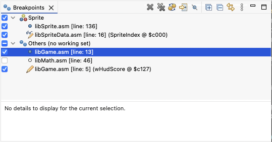
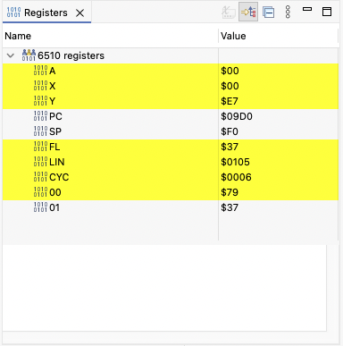

The Commodore 64, an iconic 8-bit home computer from the 1980s, has experienced a vibrant renaissance in the retro computing world. Renowned for its affordability, robust hardware, and expansive software library, the C64 continues to captivate enthusiasts worldwide. Modern resources such as FPGA-based replicas, enhanced peripherals, and thriving online communities have made it easier than ever to explore and develop for this classic machine. Essential tools like cross-assemblers, emulators like VICE, and comprehensive documentation for its 6502 architecture have become indispensable for both newcomers and seasoned developers.

Programming for the Commodore 64 is an enjoyable experience, thanks to its simplicity, constraints, and direct interaction with hardware. The 6502 assembly language offers a rewarding challenge that inspires creativity, while the well-documented architecture and active retro community make problem-solving an engaging process. Whether pushing graphical limits, composing SID chip music, or crafting efficient code within tight memory constraints, developing for the C64 is a nostalgic journey that combines technical mastery with pure joy.

The _Commodore Commander_ aims to be a useful addition to this ecosystem of tools.

# Features

This project provides a set of features for the Eclipse IDE that can be built and added into an existing Eclipse installation. It also comes with _product builds_ which are standalone applications. However these require that Java 21 is installed and in the system PATH.

## Editing


* Git support
  * "Quick diff" and revision information in editor
* Editor with 6502 opcode syntax coloring
  * Task and bookmarks
  * Search and navigation
  * Block selection
  * `TODO` and `FIXME` markers
  * Bookmarks, and much more
 * Tooltips for 6510 mnemonics
 * Tooltips for the Commodore 64 memory map
* Built-in [Kick Assembler](http://theweb.dk/KickAssembler/Main.html#frontpage) 
* Built-in [VICE](https://vice-emu.sourceforge.io) based debugger with support for stepping, memory view, variables view, live editing etc.

## Compiling

Compilation is done automatically with the built-in [Kick Assembler](http://theweb.dk/KickAssembler/Main.html#frontpage) compiler whenever a source file has been changed.

* Problem markers when a compilation produces errors.
* Compilation output to the _Commodore Commander_ console view.

## Running

* Launches the VICE emulator when double clicking a `*.prg` file.
* Launches will automatically pick up VICE configuration files found either in the same folder as the program, or in any of it's parent folders.

## Debugging

The debugger implements a [VICE Binary Monitor](https://vice-emu.sourceforge.io/vice_12.html) interface and is currently fairly basic but still useful. It currently supports the following features:

* [Breakpoints and watchpoints](#breakpoints-and-watchpoints) along with associated commands: **Step Over** , **Step Into** , **Step Return** , **Suspend** , **Resume**  and **Terminate** 
* [Registers](#registers) view showing the CPU registers with values
* [Variables](#variables) view showing and editing labeled data
* [Memory Monitor](memory-monitor) for displaying and editing memory areas
* Built in [VICE](https://vice-emu.sourceforge.io) emulator
  * macOS GTK version on aarch64 and x86_64
  * Windows GTK x86_64 version (planned)
  * Linux GTK x86_64 version (planned)
* Configurable run and debug launch shortcuts

### Breakpoints and watchpoints



VICE supports three types of _checkpoints_; _breakpoints_, _watchpoints_ and _tracepoints_. Only the two prior is supported by this IDE. Breakpoints can be created by adding the statement `.break` to your code, or by double clicking on a line in the leftmost part of the editor. Double clicking on an existing breakpoint will remove it, unless added by code.

Currently, the only way to add a _watchpoint_ is by code. Use the statement `.watch <label name>` to add a watchpoint that is triggered both by reading and writing to the named data area. Use `.watch <label name>,,"load"` to trigger when the data is read and replace `"load"` with `"store"` to trigger when the data is written.

Breakpoints can be individually disabled and enabled, and as be grouped by; types, projects, files, working custom working sets etc. They can also be exported and imported for sharing between developers or stored in a project folder.

### Registers



The **Registers** view show all of the CPU's registers and their values as the CPU is suspended. The yellow coloring indicates that the value was changed since the previous suspension.

### Variables

When building your application, the IDE will automatically detect sections of code that are labelled and that contains data. For example:

```asy
ClearTable:
    .byte %11111110
    .byte %11111101
    .byte %11111011
```

The parser will also determine which format was used to declare the values and this information is used when presenting the value in the IDE, so that it looks the same.


The **Variables** view is updated whenever the CPU is suspended. Values that are shown using the diamond icon are editable. Simply click on the value cell and specify a new value. Make sure the value is within the range of the data type. A byte value is for example between 0 and 255.

### Memory monitor

The memory monitor is used to observe and edit the main computer memory.

Using the **New Memory View**  command you can create a view that is able to display one single area of memory at the time (**Add Memory Monitor** ). This will bring up a prompt where you can specify the from and optionally to-address in either hexadecimal (prefix with `0x` or `$`). Use `-` to specify a range, and `,` to create multiple monitors.

Each monitor can be presented using different _renderings_. Each rendering is a visualization of the memory area and may or may not be editable. The table renderings are typically editable, while the screen rendering shown below is not.


Note that monitors are only updated when the CPU has stopped because of i.e. a breakpoint and any changes to the memory will only take effect when the CPU has resumed operation.

By selecting _Custom_ **Character set** and specifying it's location one can see the memory monitor rendered using this character set.


# Installing

Currently only macOS builds are downloadable from the project site. These are not notarized and must be taken out _quarantine_ in order to work. Execute `xattr -d com.apple.quarantine ~/Downloads/Commodore\ Commander.app` after downloading and unpacking the archive.

Support for providing VICE installations other than the ones built in is not yet supported. So this IDE will only work on macOS until this is remedied.

# Related resources

These resources are only some of those consulted when building this IDE. You may find them useful:

- [The Kick Assembler](http://theweb.dk/KickAssembler)
- [VICE, the Versatile Commodore Emulator](http://vice-emu.sourceforge.net)
- [Cycle-accurate 6502 emulator in Javascript](https://github.com/Torlus/6502.js)
- [Tuned Simon's BASIC](https://github.com/godot64/TSB)
- [SpritePad C64 Pro](https://subchristsoftware.itch.io/spritepad-c64-pro)
- [CharPad C64 Pro](https://subchristsoftware.itch.io/charpad-c64-pro)
- [SpriteMate](https://www.spritemate.com)
- [GoatTracker2](https://sourceforge.net/projects/goattracker2)
- [Colordore](https://www.pepto.de/projects/colorvic/)
- [PETSCII, A nice web-based editor for sprites, character maps and screens](http://petscii.krissz.hu)
- [JustJ, a Java Runtime for Eclipse](https://eclipse.dev/justj/?page=documentation)
- [Inside the Memory View: A Guide for Debug Providers](https://www.eclipse.org/articles/Article-MemoryView)
- The 1965-1984 [Commodore logo](https://en.wikipedia.org/wiki/Commodore_International#/media/File:Commodore196x.svg) [font](https://www.myfonts.com/products/d-bold-extended-microgramma-330289) (Microgramma D)
- https://www.eclipse.org/articles/Article-Debugger/how-to.html
- [64Tass](https://sourceforge.net/projects/tass64/)
- [65xx Debugger](https://marketplace.visualstudio.com/items?itemName=TRobertson.db65xx)