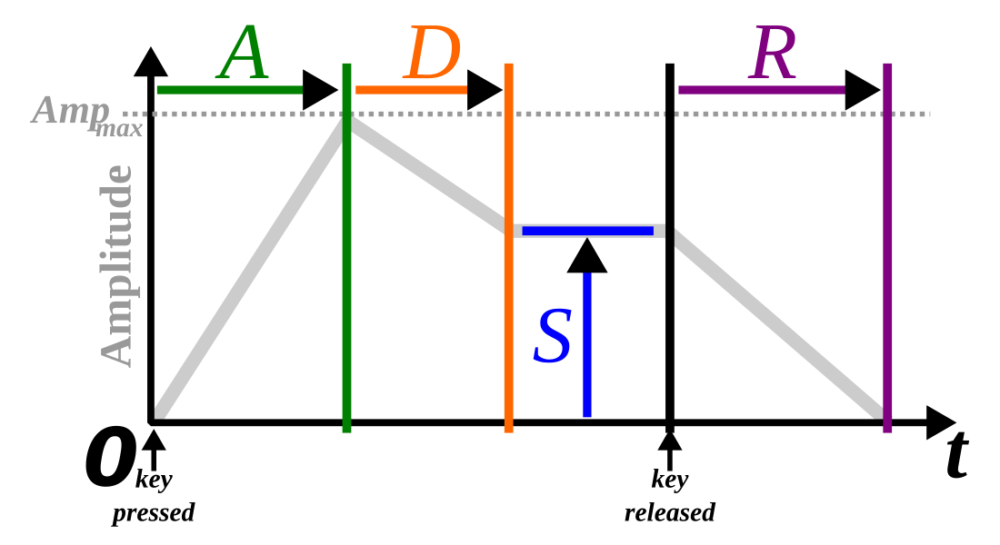

# Introduction to SIDScore

Early electronic synthesizers emerged in the 1960s as large, modular systems associated with pioneers like Robert Moog. These instruments were based on subtractive synthesis: oscillators generated harmonically rich waveforms (e.g., sawtooth or square), which were then shaped using filters and amplifiers. A critical innovation was the envelope generator, which allowed a sound to evolve over time rather than simply switching on and off.

Following discussions with the engineer and composer Vladimir Ussachevsky, the head of the Columbia-Princeton Electronic Music Center, in 1965, Moog developed a new envelope module whose functions were described in f T1 (attack time), T2 (initial decay time), ESUS (sustain level), and T3 (final decay time). These were later simplified to the modern ADSR form (attack time, decay time, sustain level, release time) by ARP.[1]

 

At the core of this control model is the ADSR envelope:

* Attack: time for the sound to reach peak amplitude
* Decay: time to fall to a sustain level
* Sustain: steady-state level while a key is held
* Release: fade-out after the key is released

This envelope concept became a standard abstraction for shaping amplitude, filter cutoff, or pitch, and remains fundamental in modern synthesis.

By the early 1980s, these principles were condensed into integrated circuits. The most influential of these was the MOS Technology 6581 SID (Sound Interface Device), designed by Bob Yannes. Released with the Commodore 64 in 1982, the SID was effectively a synthesizer on a chip. It combined digital control with analog output stages, giving it both programmability and a distinctive sonic character  .

Technically, the SID implemented three independent voices, each with:

* A programmable oscillator (triangle, sawtooth, pulse, noise)
* A dedicated ADSR envelope generator
* Modulation features such as ring modulation and oscillator sync
* A shared multimode analog filter

These features made it far more expressive than competing sound chips, which typically produced only simple tones. In effect, it was closer to a compact synthesizer than a mere sound generator.

The widespread influence of the SID was largely a consequence of the commercial success of the Commodore 64, which became the best-selling home computer of its era. Because every unit shipped with the same sound hardware, a large ecosystem of composers and programmers emerged. Unlike traditional musicians, these individuals often worked directly with low-level registers, tightly coupling composition and sound design.

Constraints—particularly the limitation of three simultaneous voices—led to distinctive techniques such as rapid arpeggiation to simulate chords, dynamic waveform switching, and creative abuse of hardware quirks. These practices defined the aesthetic of early game music and later the demoscene  .

The SID’s impact extends beyond its original context. It helped establish several enduring patterns:

* Treating sound chips as programmable instruments rather than fixed-function devices
* Integrating synthesis concepts (oscillators, filters, envelopes) into consumer hardware
* Inspiring later digital and hybrid synthesizers, including those developed by Yannes at Ensoniq

Its sonic fingerprint—characterized by sharp envelopes, resonant filters, and digitally controlled analog irregularities—remains recognizable. Modern genres such as chiptune, synthwave, and certain forms of electronic dance music explicitly reference or emulate SID-like textures.

In summary, early synthesizers introduced the core abstractions of electronic sound design, particularly the ADSR envelope. The SID chip operationalized these ideas in mass-market hardware, making synthesis accessible at scale. Its combination of technical capability, distribution, and creative constraint positioned it as a formative influence on both video game music and contemporary electronic music practices.

